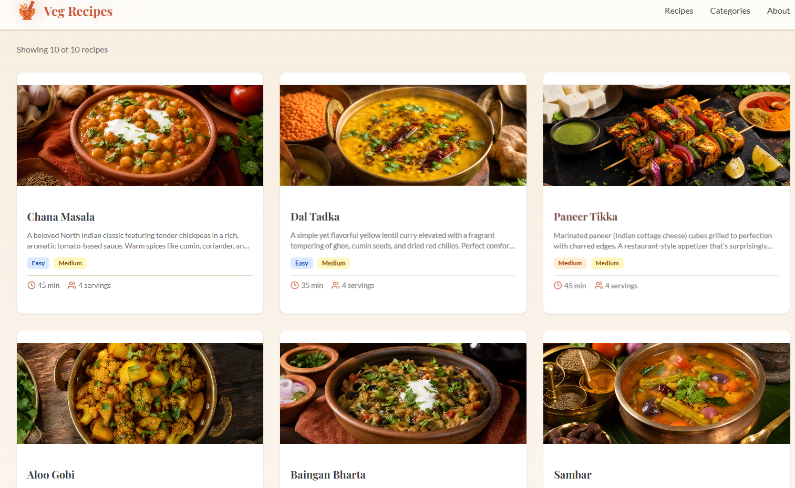

# AI Website Generation using Manus AI

## About this Project

This project is an experiment to explore how AI can generate and deploy a complete website from a single prompt.

Instead of manually writing the code, I used Manus AI to create a fully functional website and then explored the generated project structure, source code, and deployment process.

This repository documents the generated source code along with the live website and screenshots.

## Prompt Used

Create a website for finding the best vegetarian Indian recipes.

---
## Website Link

https://vegindirecipes-a5wemrrx.manus.space/
---

## Website Preview

